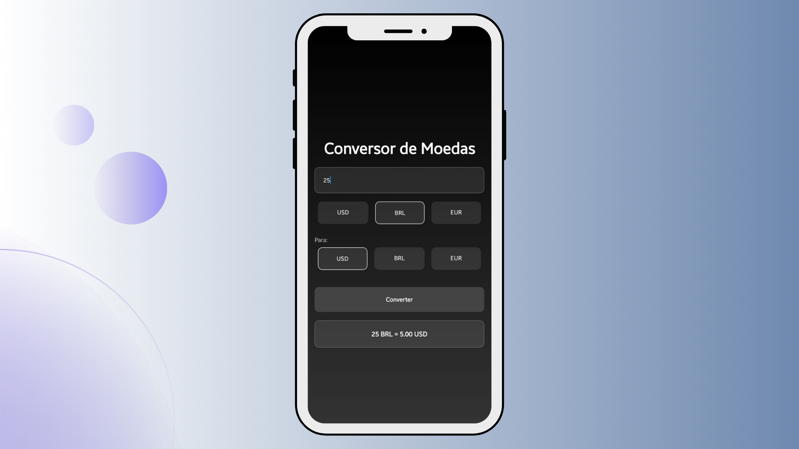

# Currency Converter App

A modern, user-friendly currency conversion application built with React Native and Expo, featuring real-time currency conversion between USD, EUR, and BRL.



## 📋 Table of Contents

- [Overview](#overview)
- [Features](#features)
- [Technologies Used](#technologies-used)
- [Prerequisites](#prerequisites)
- [Installation](#installation)
- [Usage](#usage)
- [Project Structure](#project-structure)
- [Contributing](#contributing)
- [License](#license)

## 🌟 Overview

The Currency Converter App is a mobile application that provides instant currency conversion between United States Dollar (USD), Brazilian Real (BRL), and Euro (EUR). Built with React Native and styled with Expo Linear Gradient, it offers a sleek, intuitive interface with real-time conversion rates.

## ✨ Features

- Real-time currency conversion
- Support for USD, BRL, and EUR
- Interactive UI with pressed states for buttons
- Input validation
- Gradient background design
- Responsive layout
- Type-safe implementation with TypeScript

## 🛠 Technologies Used

- React Native
- TypeScript
- Expo
- Linear Gradient
- Custom Styling

## 📋 Prerequisites

Before you begin, ensure you have the following installed:

- Node.js (v14 or higher)
- npm or yarn
- Expo CLI
- A mobile device or emulator

## 🚀 Installation

1. Clone the repository:
```bash
git clone https://github.com/yourusername/currency-converter-app.git
```

2. Navigate to the project directory:
```bash
cd currency-converter-app
```

3. Install dependencies:
```bash
npm install
# or
yarn install
```

4. Start the development server:
```bash
expo start
```

## 💻 Usage

1. Launch the app on your device or emulator
2. Enter the amount you want to convert in the input field
3. Select the source currency (USD, BRL, or EUR)
4. Select the target currency
5. Press "Converter" to see the result
6. The converted amount will be displayed at the bottom of the screen

## 📁 Project Structure

```
currency-converter-app/
├── src/
│   ├── assets/
│   │   └── images/
│   │       ├── banner.png
│   │       └── project-illustration.png
│   ├── components/
│   │   └── HomeScreen.tsx
│   └── styles/
│       └── styles.ts
├── App.tsx
├── package.json
└── tsconfig.json
```

## 🤝 Contributing

1. Fork the repository
2. Create your feature branch:
```bash
git checkout -b feature/AmazingFeature
```
3. Commit your changes:
```bash
git commit -m 'Add some AmazingFeature'
```
4. Push to the branch:
```bash
git push origin feature/AmazingFeature
```
5. Open a Pull Request

## 📄 License

This project is licensed under the MIT License - see the [LICENSE.md](LICENSE.md) file for details.

---

## 🔧 Technical Details

### Exchange Rates

The application uses a predefined exchange rate object:

```typescript
const exchangeRates: ExchangeRates = {
  USD: {
    BRL: 5.0,
    EUR: 0.85,
  },
  BRL: {
    USD: 0.20,
    EUR: 0.17,
  },
  EUR: {
    USD: 1.18,
    BRL: 5.89,
  }
};
```

### Type Definitions

```typescript
type CurrencyCode = 'USD' | 'BRL' | 'EUR';

type ExchangeRates = {
  [key in CurrencyCode]: {
    [key in CurrencyCode]?: number;
  };
};
```

## 📱 Screenshots

[Add your app screenshots here]

## ✍️ Authors

- **Your Name** - *Initial work* - [YourGithubUsername](https://github.com/YourGithubUsername)

## 👏 Acknowledgments

- Hat tip to anyone whose code was used
- Inspiration
- etc

---

Made with ❤️ by [Your Name](https://github.com/yourusername)